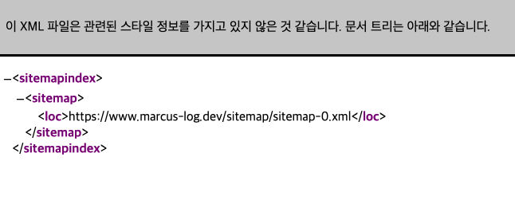
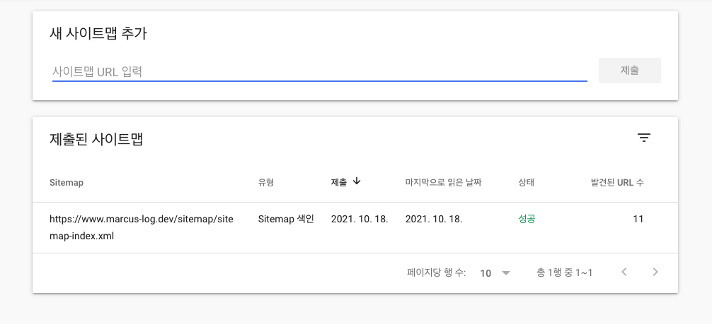

현재까지 블로그를 운영하면서 검색엔진에 노출되기 위한 SEO 작업을 한번도 진행한적이 없어 이를 진행하기로 결정하고 최적화를 위해 어떤 작업을 했는지에 대한 공유를 하려고 합니다.

먼저 이 작업을 진행하기 전에 SEO 최적화는 왜 필요하며 검색 엔진은 어떤 방식으로 동작하는지에 대해서 간략하게 알아보겠습니다.

다양한 검색 엔진이 존재하지만 대표적인 google의 검색 엔진을 통해 검색 동작 원리를 알아보겠습니다.

검색 엔진은 다음과 같은 순서로 동작합니다 `크롤링 -> 색인 생성(인덱싱) -> 게재` 

#### 크롤링


첫번째 단계는 웹페이지의 존재를 찾는 것입니다. Google은 웹 크롤러라는 소프트웨어를 사용해 웹 페이지를 발견합니다. 발견할때 robots.txt를 참조하며 sitemap에 작성된 URL로 크롤러에게 조금 도움을 줄 수 있습니다.

#### 색인 생성을 통한 정보 구성 (인덱싱)


크롤러가 웹페이지를 찾으면 Google 시스템에서는 브라우저와 마찬가지로 해당 페이지의 콘텐츠를 렌더링합니다. 이때 키워드 및 웹사이트 최신 정보에 이르는 주요 신호를 기록하며 검색 색인에서 모든 주요 신호를 추적합니다.

#### 게재(및 순위 지정)

사용자가 검색어를 입력하면 Google이 여러 요소를 바탕으로 색인을 바탕으로 수집한 데이터를 기준으로 표시합니다.

우리는 위 과정에서 **크롤링**에 해당하는 작업을 조금 더 잘할 수 있도록 설정해줄 예정입니다.

#### Sitemap

Sitemap은 웹사이트 내 모든 페이지의 목록을 나열한 파일로 책의 목차와 같은 역할을 합니다.

사이트맵을 제출하면 각 사이트 크롤링봇이 크롤링을 할 때 쉽게 발견되고 색인될 수 있도록 도와주는 역할을합니다.

예시 사이트맵을 보시고 간단하게 문법을 알아봅시다.

```xml
<?xml version="1.0" encoding="UTF-8"?>
<urlset xmlns="http://www.sitemaps.org/schemas/sitemap/0.9" xmlns:news="http://www.google.com/schemas/sitemap-news/0.9" xmlns:xhtml="http://www.w3.org/1999/xhtml" xmlns:mobile="http://www.google.com/schemas/sitemap-mobile/1.0" xmlns:image="http://www.google.com/schemas/sitemap-image/1.1" xmlns:video="http://www.google.com/schemas/sitemap-video/1.1">
<url>
	<loc>https://www.marcus-log.dev/resume/</loc>
	<changefreq>daily</changefreq>
	<priority>0.7</priority>
</url>
<url>
	<loc>https://www.marcus-log.dev/using-typescript/</loc>
	<changefreq>daily</changefreq>
	<priority>0.7</priority>
</url>
</urlset>
```

- `loc` : 페이지의 URL로 http와 같은 프로토콜로 시작해야 합니다.
- `lastmod` : 파일을 마지막으로 수정한 날짜입니다. 이 날짜는 [w3.org](http://www.w3.org/TR/NOTE-datetime) 형식이어야 합니다.
- `changefreq` : 페이지가 변경되는 빈도를 나타냅니다.
- `priority` : 해당 사이트의 기타 URL에 대한 특정 URL의 상대적 우선순위를 나타냅니다. 유효 범위로는 0.0~ 1.0이며 페이지의 기본 우선순위는 0.5입니다.

사이트맵에 간단하게 알아보았으니 제 블로그에서 sitemap을 어떻게 적용했는지에 대해서 알아보겠습니다.

사이트맵을 블로그 포스팅할때마다 진행하면 귀찮기 때문에 아래 라이브러리를 사용할 예정입니다.

[gatsby-plugin-sitemap](https://www.gatsbyjs.com/plugins/gatsby-plugin-sitemap/)

```jsx
$ npm install -save gatsby-plugin-sitemap
```

해당 라이브러리를 설치하고 gatsby-config.js 파일에 다음과 같이 설정해주세요.

```jsx
module.exports = {
	siteMetadata: {
    title: `Marcus log`,
    author: {
      name: `Marcus`,
      summary: `Frontend Developer Marcus.`,
    },
    description: `개인적으로 공부한 내용들을 정리하는 블로그입니다.`,
    siteUrl: `https://www.marcus-log.dev`,
  },
  plugins: [
		...
		`gatsby-plugin-sitemap`,
		...
	]
	...
}
```

사이트맵이 자동으로 잘 생성됐는지 확인하고 싶다면 `gatsby build` 를 입력 후

`public > sitemap > sitemap-index.xml, sitemap-0.xml` 이 생성됐다면 정상적으로 생성된것입니다.

`localhost:PORT/sitemap/sitemap-index.xml` 에서 확인해보세요!



사이트맵을 생성하는 방법까지 알아보았으니 사이트맵과 밀접한 관계가있는 robots.txt에 대해서 알아보겠습니다.

#### robots.txt

---

robots.txt는 크롤링봇에게 사이트 및 웹페이지를 수집할 수 있도록 허용하거나 제한할 수 있는 파일입니다.

robots.txt 파일에 규칙을 간단한 예제를 통해서 알아보겠습니다.

- 모든 검색엔진의 로봇에 대하여 수집 허용으로 설정할 경우.

```xml
User-agent: *
Allow: /
```

- 사이트의 루트 페이지만 수집 허용으로 설정할 경우.

```xml
User-agent: *
Disallow: /
Allow: /$
```

- 관리자 페이지, 개인 정보 페이지와 같이 검색로봇 방문을 허용하면 안되는 페이지를 설정할 경우

```xml
User-agent: *
Disallow: /private*/
```

- 모든 크롤링봇에게 사이트의 모든 페이지에 대하여 수집을 허용하지 않을 경우.

```xml
User-agent: *
Disallow: /
```

- Sitemap.xml 지정

```xml
User-agent: *
Allow: /
Sitemap: https://www.marcus-log.dev/sitemap/sitemap-index.xml
```

Sitemap을 지정할 경우 내 사이트에 있는 페이지들의 목록이 담겨있는 sitemap.xml의 위치를 robots.txt에 기록해 크롤링봇이 내 사이트의 콘텐츠(URL)을 더 잘 수집할 수 있도록 도울 수 있습니다.

이제 robots.txt에 대해서 알아보았으니 블로그에 적용될 robost.txt를 다음과 같이 작성했습니다

```xml
User-agent: *
Allow: /
Sitemap: https://www.marcus-log.dev/sitemap/sitemap-index.xml
```

저는 모든 봇에서 크롤링을 하는걸 원하고 모든 페이지에 접근을 허용해줬습니다.

#### Google Search Console 등록

마지막으로 Sitemap과 Robots.txt를 작성 후 Google Search Console에 등록해줬습니다.

Sitemap에 나와있는 URL을 기준으로 색인이 정상적으로 잘 이루어졌는지 확인하고 어떠한 키워드로 블로그에 진입했는지 확인하기 위해서입니다.



보시는것처럼 Sitemap 색인이 정상적으로 잘 이루어진걸 확인하실 수 있습니다.

색인 생성 범위, 실적 등 Google Search Console에서 많은 기능을 지원하지만 아직 페이지가 수집된지 얼마 지나지않아 데이터가 모이지 않았습니다 관련된 데이터는 2편에서 공유드리도록 하겠습니다 ✍️

#### 레퍼런스

[sitemaps.org](https://www.sitemaps.org/ko/protocol.html)

[robots.txt 설정하기](https://searchadvisor.naver.com/guide/seo-basic-robots)
