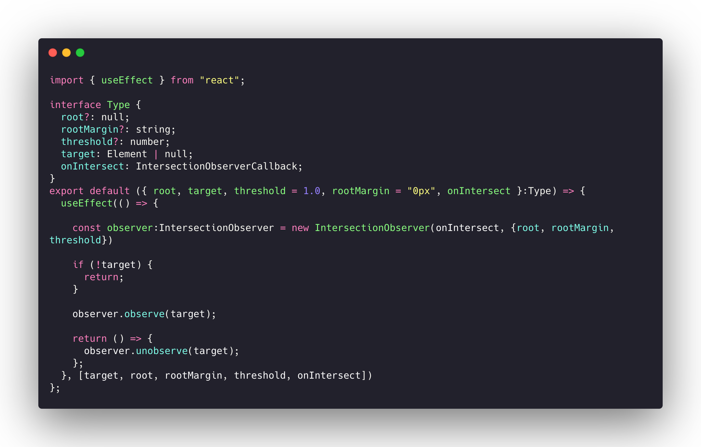
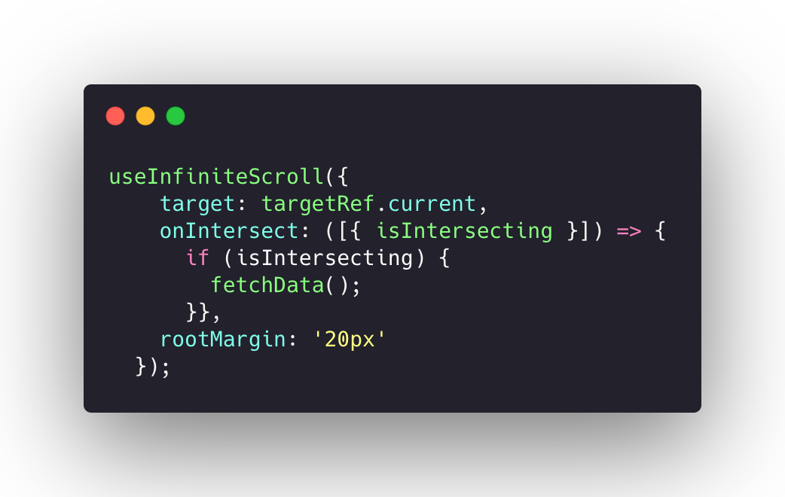

안녕하세요 Marcus입니다.

이번에는 Intersection Observer와 React를 이용해서 InfiniteScroll을 만들어보겠습니다.

기본적인 Intersection Observer에 대한 지식은

https://www.marcus-log.dev/IntersectionObserver%20 를 참고해주세요

---
저는 기존에 Infinite Scroll을 구현할때 사용하는 방식은 winodw에 접근해 position을 이용해 작성했습니다.

그럼 어떻게 Intersection Observer를 이용해서 Infinite Scroll을 구현해볼 수 있는지 보겠습니다.

먼저 기존에 window scroll에 position을 이용해서 구현할때와 Intersection Observer를 이용해서 구현할때에 가장 큰 차이점을 알아보겠습니다.

#### Reflow의 문제

구글에서는 Reflow를 다음과 같이 정의하고있습니다.
>Reflow is the name of the web browser process for re-calculating the positions and geometries of elements in the document, for the purpose of re-rendering part or all of the document.

>리플로우 는 문서내의 요소들에 대해서 위치와 좌표를 다시 계산하는 웹 브라우저의 프로세스이다. 이는 문서의 일부분 혹은 전부를 다시 렌더링 할 때 사용된다.

즉, Reflow는 정보를 계산해서 다시 렌더링을 하는 현상을 뜻합니다. 
이는 해당되는 엘리먼트 뿐만 아니라 그 엘리먼트가 포함하는 자식들에 대해서도 리플로우를 일으키죠.
우리가 생각하는것보다 렌더링을 하는 작업은 비용이 많이 들어가는 작업입니다.
그러면 왜 window에 scroll postion을 이용해서 구현할때는 Reflow가 일어날까요?
우리가 scroll position을 이용할때 `getboundingclientrect`을 이용해서 좌표값을 얻어오고 좌표값을 계산해서 구현하는 방식을 채용합니다.
이 과정에서 reflow가 일어나고 scroll event 특성상 스크롤이 일어날때마다 함수가 실행되기때문에
많은 reflow가 일어나기때문에 퍼포먼스 측면에서 치명적일 수 있는것이죠
물론 `debounce`나 `throttle` 를 사용해서 이를 어느정도 커버할 수 있겠지만 그래도 Reflow는 굉장히 치명적이라고 생각합니다.

저는 이 이유만으로도 Intersection Observer를 사용할 이유는 충분하다고 봅니다.

그러면 어떻게 구현했는지 코드를 보시죠

`useInfiniteScroll.tsx`

코드를 보시면 `observer.observe(target)` 를 이용해 관찰을 시작합니다.

이후 unmount를 이용해 관찰을 종료합니다.

`사용하는곳`

사용하는곳에서는 `isInterecting`이 true이면
api를 요청해 데이터를 추가합니다.

생각보다 간단한 코드로 reflow를 고려한 Infinite Scroll을 구현할 수 있습니다.

어떠신가요? 생각보다 Intersection Observer를 이용하면 쉽게 구현할 수 있습니다.

이번 포스팅에서는 여기에서 마무리하겠습니다. 감사합니다.

---
written by Marcus 

