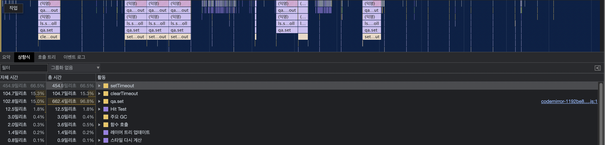
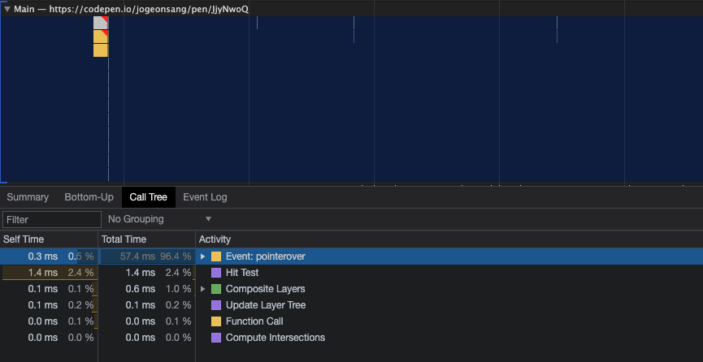

Intersection Observer API는 타겟 요소와 상위 요소 또는 최상위 document 의 viewport 사이의 intersection 내의 변화를 비동기적으로 관찰하는 방법입니다.

Intersection Observer API에 대해서 자세하게 알아보기 전에 왜 Intersection Observer API가 나오게 됐는지 먼저 알아보겠습니다. 

### 기존 scroll 이벤트의 문제점
---

Intersection Observer API 이전에 요소의 가시성이나 두 요소의 상대적인 가시성을 탐지해야할 때 즉 특정 위치에 도달했을 때 어떤 액션을 취해야 했다면 어떻게 구현했을까요?

대부분 `addEventListener()` 의 `scroll` 이벤트를 등록했을겁니다. `window` 에 스크롤 이벤트를 등록하고, 특정 지점을 관찰하며 엘리먼트가 위치에 도달했을 때를 체크해 실행할 콜백함수를 등록했었죠.

하지만 scroll 이벤트는 단시간에 수백번, 수천번 호출될 수 있고 동기적으로 실행되기 때문에 메인 스레드에 영향을 줄 수 있습니다.

MDN에서는 위 예시와 다음 예시를 들고 문제가 생길 수 있다고 얘기합니다. 한 페이지 내에 여러 `scroll event` 가 등록되어 있을 경우, 사용자가 스크롤을 할 때 마다 등록되어있는 이벤트가 끊임없이 호출될 수 있습니다.

또한 특정 지점을 관찰하기 위해서는 [Element.getBoundingClientRect()]([https://developer.mozilla.org/ko/docs/Web/API/Element/getBoundingClientRect](https://developer.mozilla.org/ko/docs/Web/API/Element/getBoundingClientRect))

함수를 사용했는데, 이 함수는 [reflow]([https://developer.mozilla.org/ko/docs/Glossary/Reflow](https://developer.mozilla.org/ko/docs/Glossary/Reflow)) 현상이 발생한다는 단점이 있습니다.

> Reflow는 간단하게 설명하면 browser가 웹 페이지의 일부 또는 전부를 다시 처리하고 그려야 하는 현상을 말합니다.
> 

예시를 통해 기존 방식 `addEventListener()` 에 `getBoundingClientRect` 로 구현했을 때 reflow가 일어나는지 확인해보겠습니다.

> 아래 결과물을 확인해주세요!
> 

<iframe width="100%" height="500" src="//jsfiddle.net/Jogeonsang/t32Lqxp7/1/embedded/result/dark/" allowfullscreen="allowfullscreen" allowpaymentrequest frameborder="0"></iframe>


해당 코드에서 `reflow` 가 발생하는 시점을 확인해보면 Event 호출(call event) → 레이어 트리 업데이트(reflow) → 스타일 다시 계산(repaint) 가 일어나는걸 확인하실 수 있습니다.



이처럼 단편적으로 기존에 구현 방식으로는 모든 코드가 메인 스레드에서 실행되고 성능을 저하시킬 수 있는 문제가 발생하기 때문에 이중, 하나라도 문제가 생긴다면 치명적인 성능 문제를 일으킬 수 있습니다.

### Intersection Observer API
---

[Intersection Observer API]([https://developer.mozilla.org/ko/docs/Web/API/Element/getBoundingClientRect](https://developer.mozilla.org/ko/docs/Web/API/Element/getBoundingClientRect))는 기본적으로 비동기로 동작하며 등록해놓은 Observer(element) 요소가 다른 viewport에 들어가거나 나갈 때 실행될 콜백 함수를 등록합니다. 즉 사이트는 element와 view의 교차를 지켜보기 위해 메인 스레드를 사용할 필요가 없어지며 최적화를 할 수 있습니다.

> 아래 결과물을 확인해주세요!
> 


<iframe width="100%" height="500" src="//jsfiddle.net/Jogeonsang/qt6eLch0/1/embedded/result/dark/" allowfullscreen="allowfullscreen" allowpaymentrequest frameborder="0"></iframe>





해당 코드를 바탕으로 체크해본 퍼포먼스상황을 보시면 기존 scroll event로 처리할때와 달리 함수 호출 후 `reflow` 가 발생하지 않는것을 확인하실 수 있습니다. 

위처럼 스크롤 계산에 있어 많은 리소스 소모가 일어나지 않기 때문에 viewport를 감지해 어떤 액션, 인터렉션이 일어나는 기능들을 보다 부담없이 구현할 수 있게 되었습니다.

단편적으로 지금 구현체처럼 viewport에 감지되었을 때 animation을 호출한다거나, 사용자가 문서를 어디까지 읽었는지도 저장해 북마크 형식으로 보여줄 수 있겠죠!

지금까지 Intersection Observer가 나오게된 계기와 효과를 알아봤으니 자세하게 Intersection Observer를 사용하려면 어떤 메서드들이 있는지 확인해보시죠!

### Intersction Observer 사용 방법
---

Intersection Observer API는 기본적으로 다음과 같은 구조를 가지고 있습니다.

```tsx
// create an Intersection Observer
const observer:IntersectionObserver = new IntersectionObserver(callback, [options]);
```

기본적인 구조로는 엘리먼트와 viewport가 교차했을 때 실행될 callback함수를 전달하고 선택적으로 options를 전달할 수 있습니다.

## Callback Func

타겟 엘리먼트와 viewport가 교차되었을 때 실행되는 함수입니다.

### entries

---

entries는 [IntersectionObserverEntry](https://developer.mozilla.org/en-US/docs/Web/API/IntersectionObserverEntry) 인스턴스의 **배열** 입니다. IntersectionObserverEntry는 읽기 전용(Read only)의 다음 속성들을 포함합니다.

Array Type이기 때문에 forEach를 사용하거나, 단일 타겟일 경우 배열인점을 고려해 코드를 작성해야 합니다.

### observer

---

콜백함수가 호출되는 Intersection Observer 입니다.

## options

Intersection Observer가 교차하는 순간을 수치로 조정할 수 있는 parameters입니다.

### root

---

root 로 정의된 Element 기준으로 Target Element 의 가시성을 확인하는 뷰포트로 사용되는 요소입니다.
(노출될지 말지를 결정하는 option)

기본값은 `null` 이며 기본 Browser Viewport 를 참조합니다.

```tsx
const io = new IntersectionObserver(callback, {
  root: document.getElementById('my-viewport')
})
```

### rootMargin

---

기본적으로 css에서 margin을 입력하는 방식과 동일하며 이 값에 따라 교차영역이 확장되거나축소됩니다. 

기본값은 `'0px 0px 0px 0px'` 입니다.

```tsx
const io = new IntersectionObserver(callback, {
  rootMargin: '200px 0px' // Top Bottom 200px, Left Right 0px
})

const io = new IntersectionObserver(callback, {
  rootMargin: '10px 0px 30px 0px' // Top 10px, Right 0px, Bottom 30px, left 0px
})
```

### threshold

---

타겟 엘리먼트가 교차영역에 진입했을 경우 실행하는데 이때 어느 영역에 접근했을 때 실행되는지를 결정합니다. 값은 백분율로 표시하며 타겟 엘리먼트가 50%정도 보여졌을 때 observer가 실행되길 원하신다면 0.5로 옵션을 주시면 됩니다.

기본값은 `0` 입니다.

```tsx
const io = new IntersectionObserver(callback, {
  threshold: 0.5 // or `threshold: [0.5]`
})
```

## Methods

Intersection Observer에서 사용할 수 있는 method입니다.

### observe()

---

타겟 엘리먼트의 관찰을 시작합니다.

```tsx
const io = new IntersectionObserver(callback, options);

const targetElement = document.querySelector('div');

io.observe(targetElement); // targetElement 관찰
```

### unobserve()

---

타겟 엘리먼트의 관찰을 중지합니다.

만약 intersectionObserver가 관찰하고 있지 않은 대상이 인자로 넘어오게되면 아무런 동작도 하지 않습니다.

```tsx
const io = new IntersectionObserver(callback, options);

const targetElement = document.querySelector('div');

io.observe(targetElement); // targetElement 관찰

io.unobserve(targetElement); // targetElement 관찰 중지
io.unobserve(nothing); // 아무런 동작도 하지 않음.
```

조금 더 자세하게 보면 다음과 같이 사용됩니다.

```jsx
const io1 = new IntersectionObserver((entries, observer) => {
  entries.forEach(entry => {
    // 가시성의 변화가 있으면 관찰 대상 전체에 대한 콜백이 실행되므로,
    if (!entry.isIntersecting) {
      return
    }
		// entry target을 관찰 시작
		observer.observe(entry.target);
		...
    // 위 코드를 처리하고(1회) 관찰 중지
    observer.unobserve(entry.target)
  })
}, options)
```

### disconnect()

---

IntersectionObserver 인스턴스가 관찰하는 모든 요소의 관찰을 중지합니다.

```jsx
const io = new IntersectionObserver(callback, options)

// ...

io.observe(div)
io.observe(h1)

io.disconnect() // io가 관찰하는 모든 요소(div, h1) 관찰 중지
```

## IE Support

---

IntersectionObserver API를 지원하지 않는 브라우저(MSIE)에서도 사용할 수 있도록 

공식적으로 [라이브러리](https://github.com/w3c/IntersectionObserver/tree/master/polyfill)가 지원됩니다. 따로 설정할 것 없이 모듈을 가져오기만 하면 됩니다.

```bash
$ npm i intersection-observer
```

```bash
// for IE
import 'intersection-observer'

// 동일하게 사용하면 됩니다.
const io = new IntersectionObserver(callback, options)
```

### Intersection Observer 사용 예시

[https://www.marcus-log.dev/InfiniteScroll/](https://www.marcus-log.dev/InfiniteScroll/)

[https://www.marcus-log.dev/Lazy-Loading/](https://www.marcus-log.dev/Lazy-Loading/)

### Reference

[http://blog.hyeyoonjung.com/2019/01/09/intersectionobserver-tutorial/](http://blog.hyeyoonjung.com/2019/01/09/intersectionobserver-tutorial/)

[https://velog.io/@young_pallete/Reflow-Repaint을-알아보자](https://velog.io/@young_pallete/Reflow-Repaint%EC%9D%84-%EC%95%8C%EC%95%84%EB%B3%B4%EC%9E%90)

[https://heropy.blog/2019/10/27/intersection-observer/](https://heropy.blog/2019/10/27/intersection-observer/)