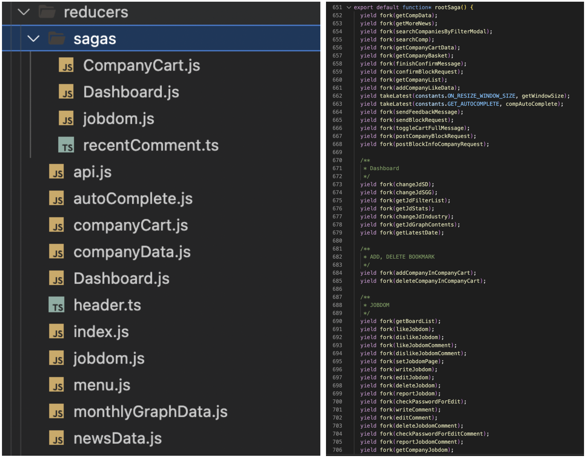
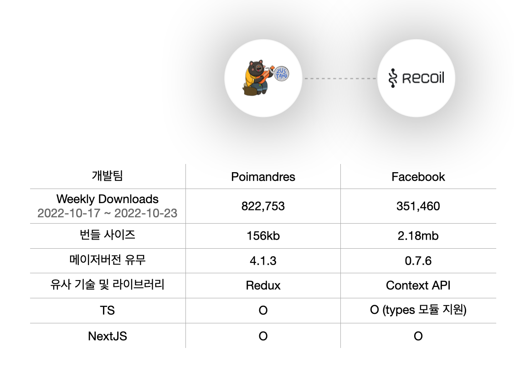
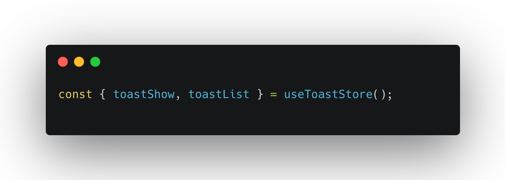
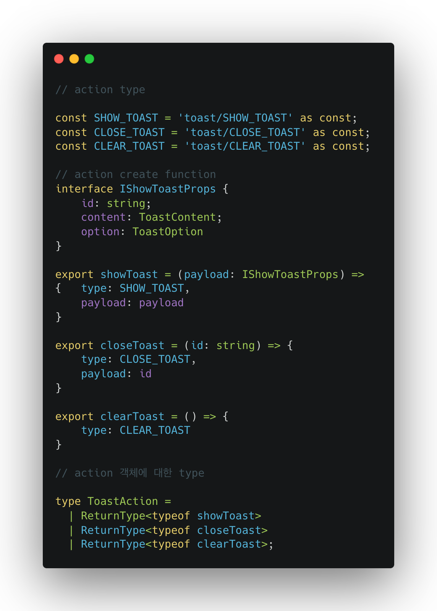
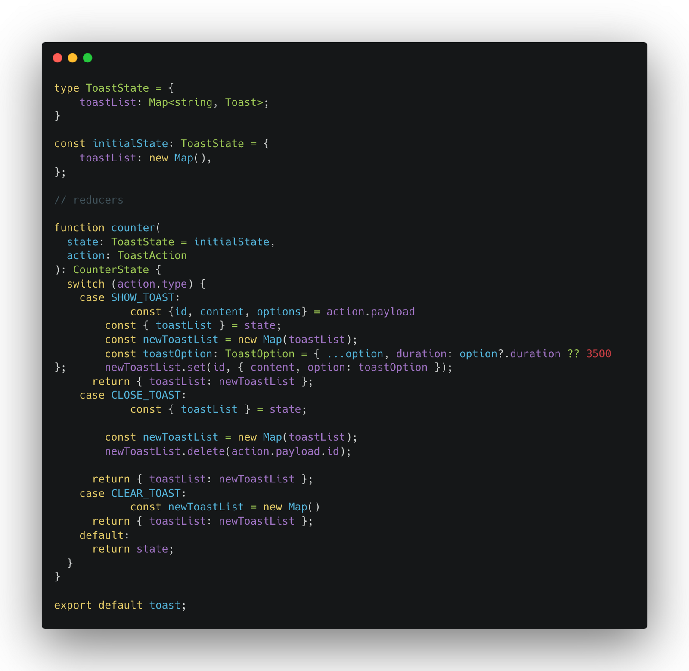
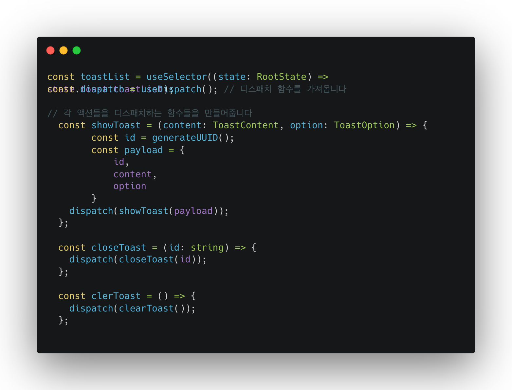

안녕하세요 원티드랩 채용사업부 크레딧잡팀에 프론트엔드 개발자 조건상입니다.

원티드 프론트엔드팀에서 새로운 상태 관리 라이브러리를 선택하는 과정에 대해 공유합니다.

### 크레딧잡의 역사

과정을 공유하기 앞서 기술 선택에 이해를 돕기 위해 크레딧잡에 기존 상황과 히스토리에 간략하게 정리하고 들어가겠습니다.

크레딧잡은 2018년 9월 원티드랩이 인수를 결정하고 2022년 1월까지 3년이 넘는 시간 동안 코드 관리를 하고 있지 않았습니다. 그렇기 때문에 크레딧잡은 2018년 구조에 머물러있었고 이는 원티드랩에 메인 기술 스택과 상이했으며 기술 히스토리가 남아있지 않아 빠르게 달려야 하는 크레딧잡이 인내하기에는 기술 부채가 크다고 생각했습니다.

짧게 어떤 구조로 상태 관리가 일어나고 있는지 예시 이미지를 첨부하겠습니다.

기존 프로젝트에 store 구조와 saga 코드

1. 코드 상의 약속된 보일러 플레이트가 존재하지 않습니다.
2. 하나의 saga 파일에서 대부분을 관리하다 보니 디버깅 혹은 코드를 수정해야 할 때 사이드이펙트 발생 확률이 굉장히 높은 점을 꼽았습니다. 자세한 문제점은 아래와 같습니다.

(어떤 코드는 saga를 통해 api에 response를 관리하고, 어떤 코드는action, reducer만 사용하는 보기만 해도 어지러운 코드…)

### 대부분의 API를 Redux와 Saga를 조합하여 구현되어 있다.

이는 react-query를 통해 관리하게 된 설계에서 벗어나게됩니다.

### 하나의 파일에서 여러 Saga가 작성되어 있고 그 코드는 700줄에 해당하는 많은 코드가 뒤섞여있는 문제가 있습니다.

이는 분명 사이드이펙트를 유발할 가능성이 높으며, 코드 자체에 의존성이 강하게 결속되어 있기 때문에 수정 또한 쉽지 않습니다.

### local 상태로 관리할 수 있는 상태임에도 불구하고 대부분 Redux로 상태 관리가 되고 있는 문제

위 문제점들을 근거로 저희는 Redux 구조를 현재 상태로 freeze 하고 앞으로 개발되는 기능에는 새로운 상태 관리 라이브러리를 도입해 사용하고 문제가 없다면 기존 구조도 마이그레이션하기로 결정했습니다.

### 새로운 상태 관리 라이브러리가 갖춰야 할 조건

### 러닝 커브가 낮아야 한다.

새로운 라이브러리를 도입하는 만큼 현재팀 이외에도 다른 개발자가 투입되어 개발을 하더라도 Redux에 대한 이해가 있는 개발자라면 최대한 적은 학습비용으로 프로젝트에 투입될 수 있어야 한다.

### 생태계가 이루어져 있어야 하며 이미 React 생태계에 자리 잡은 라이브러리여야만 한다.

새로운 라이브러리를 도입했지만 관리가 안 되거나 추후 지원을 안 했을 경우 구조가 망가지거나 코드를 바꿔야 하는 가능성을 제외.

그렇게 나온 Recoil vs Zustand

다음과 같은 기준으로 두 라이브러리를 비교해 봤고, 저희 크레딧잡팀이 선택한 라이브러리는. “**Zustand”**였습니다.

Zustand를 선택한 간략한 이유는 다음과 같습니다.

1. 2022년 10월을 기점으로 주 다운로드 수는 약 2.5배 이상 차이 나고 있다. (생태계 관점)
2. Recoil은 Facebook 개발팀이 개발을 진행하고 있지만 세상에 나온 지 2년이 넘는 시간 동안 아직 메이저 버전을 업데이트하지 않은 점. issue가 많고 해당 issue에 대한 처리가 지나치게 느리다는 점.
3. Recoil의 생태계가 우상향하고 있지만 그 성장세가 가파르지 않으며 Zustand와 비교했을 때 생태계 크기가 비교된다는 점
4. hook를 상태 소비의 주요 수단으로 만들고 렌더링을 일으키지 않고 컴포넌트에 일시적으로 알릴 수 있다는 점.

위 이유들을 근거로 Zustand를 선택하게 되었습니다. (필자가 Zustand를 굉장히 좋아해서도 이유가 있습니다..)

### Zustand의 핵심과 간략한 사용 방법

Zustand의 핵심을 Zustand의 개발팀은 다음과 같이 서술하고 있습니다.

> A small, fast and scalable bearbones state-management solution using simplified flux principles.

> 작은 단위로 사용되며 빠르고 redux보다 조금 더 심플한 flux 패턴의 구현체입니다.

핵심 키워드에도 적혀있지만 Zustand는 Flux 패턴의 구현체입니다. 이는 Redux와 같은 공통점을 가지고 있죠.

Zustand의 사용 방법을 논하는 글은 아니기 때문에 간단하게 Toast UI를 핸들링하는 상태로 Redux와 비교해 보고 글을 마무리하겠습니다.

(실제 비즈니스 코드가 아니라 이해를 돕고자 예시 코드이니 보기 힘들더라도 양해 부탁드립니다 🙏)

### Zustand로 구현한 Toast Handler

### Zustand / Store 생성

### Zustand / 실제 사용 코드 (hooks)

### Redux로 구현한 Toast handler

### Reudx / Action

### Redux / reducer

### Redux / 실제 사용 코드

기존에 사용하던 Redux와 새롭게 사용하게 된 Zustand로 동일한 로직에 코드를 작성해 봤습니다.

어떠신가요? 동일한 로직을 구현하지만 Zustand는 적은 코스트를 사용하여 코드를 작성하게 됩니다.

이는 저희가 느끼기에 굉장히 큰 장점으로 다가왔고 기존 Redux에서 사용하던 devtools를 사용할 수 있고 다양한 3rd-Party Libraries를 제공하여 수준 높은 상태 관리를 할 수 있다는 점에서도 매력적으로 느껴졌습니다.

### 크레딧잡의 전역 상태 관리 룰

크레딧잡은 Zustand로 변경하고 어떤 룰로 상태 관리를 진행하고 있을까요?크레딧잡은 기존 saga를 사용해서 api까지 핸들링하고 있던 구조를 다음과 같이 변경하고 바꾸게 되었습니다.

1. Redux Saga를 통해 API 핸들링을 하던 구조를 react-query로 이관
2. 지역 상태로 관리할 수 있으며 꼭 전역 상태로 관리되지 않아도 되는 비즈니스 로직은 지역 상태(state)를 이용하여 관리
3. 꼭 전역 상태로 관리되어야 하는 값만 전역 상태 관리 (User, Toast, Modal, Enviroment 등)

다음과 같은 룰을 지켜 기존에 Redux 구조로 되어있는 코드를 Zustand로 마이그레이션하는데 성공했습니다.

마지막으로 같이 개발하고 계신 팀원들이 느끼는 Zustand로 변경하고 3개월간에 느낀 점으로 글을 마무리하겠습니다.

### redux를 썼을 때랑 어떤 체감 차이가 있나요?

기백님 : 너무 쉽습니다. redux를 사용했을 때 코드와 아키텍처 레벨에서 부수적인 것들을 정했어야 하는데 zustand는 설정이 쉽고 가벼워서 놀라웠습니다.

건상님 : 적은 양의 코드로 전역적인 상태 관리를 한다는 점이 저에게는 큰 차이점으로 느껴졌고, 기백님이 말씀하신 것처럼 Provider가 존재하지 않아 설정 자체가 쉽고 가벼워서 좋았던 것 같습니다.

### zustand를 사용하시는데 만족하시나요?

기백님 : 만족합니다. 우선 너무 쉬워서 redux처럼 무거운 마음(?)으로 설정하지 않아도 됩니다. 그리고 커뮤니티도 어느 정도 활발하고, 운영도 잘 되고 있는 라이브러리라 만족도가 높습니다.

건상님 : 물론 Redux가 생태계가 더 거대하지만 기존에 Redux와 동작 방식이 비슷해 러닝 커브가 낮다는 점과 커뮤니티가 생각보다 거대해 막히는 부분이 있을 때 쉽게 해소할 수 있는 부분에서 아주 만족합니다. (곰도 귀여워요)

### 결론

팀마다 정한 룰이 있고 팀이 수용할 수 있는 기술 부채에 크기가 있다고 생각합니다.

저희 팀은 빠르게 서비스를 확장해야 하는 시기에 안고 가기에는 큰 기술 부채라고 생각했고 위에 문제점들을 바탕으로 기존 상태 관리 방식에서 Zustand로 새로운 상태 관리 방식을 만들기로 결정했습니다. 그 결과 서비스 확장과 유지 보수 측면에서 기술 부채를 통해 발생할 수 있는 문제들을 해결했다고 생각하고 이 일이 비즈니스에 큰 도움이 된다고 생각합니다.

좋은 시스템을 만들기 위해서 노력해 주시고 옳은 일이라고 응원해 주신 프론트엔드 팀원분들께 감사드립니다.
